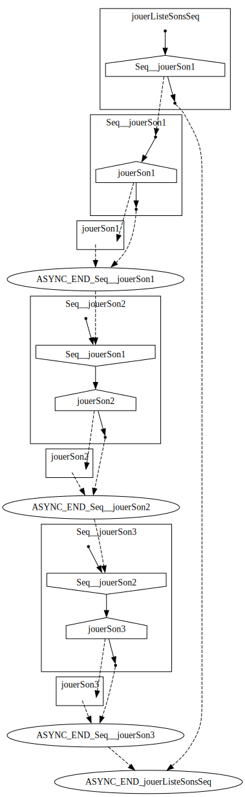
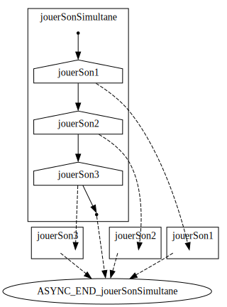

# Asynchronisme avec des callbacks

Nous avons dékà travaillé avec les callbacks (fonctions de rappel) dans le cadre de la programmation événementielle. Nous allons voir ici comment les utiliser pour gérer l'asynchronisme.
Les callbacks semblent à première vue être de bonnes condidates pour cela. En effet, elles permettent de définir une fonction qui sera appelée quand une instruction asynchrone termine.

Supposons qu'on dispose de la fonction synchrone suivante :

```typescript
function jouerSon(url: string): void;
```

Cette fonction ne "rendra la main" qu'après avoir joué le son dont l'URL est passé en paramètre.

On veut rendre cette fonction asynchrone. Pour cela, on va ajouter un paramètre de type callback à la fonction de sorte à ce que cette callback soit appelée quand le son a fini d'être joué. La fonction va cette fois "rendre la main" immédiatement. Notez que le fait que la fonction rende la main immédiatement ne provient pas du simple fait d'avoir ajouté un paramètre de type callback. Pour que la fonction fonctionne effectivement comme cela il faut qu'elle s'appuie sur d'autre fonctions asynchrone ou qu'elle soit implementée au niveau du moteur JavaScript (comme c'est le cas pour les fonctions asynchrones de l'API Web telle que **`fetch`**). On ne présente donc pas ici les détails d'implémentation mais seulement la signature.

```typescript
/**
 * Joue le son dont l'URL est passé en paramètre 
 * et appel cb lorsque le son a fini d'être joué.
 */
function jouerSon(url: string, cb: () => void): void;
```

## Généralisation

On peut généraliser cette approche à toute fonction asynchrone à base de callback.
On ajoute un paramètre de type callback à ce qu'aurait été la version synchrone de la signature de la fonction. Cette callback sera appelée quand l'instruction asynchrone aura terminé son exécution. On peut ainsi chainer les instructions asynchrones en utilisant ces callbacks.

## Exercice 1 : Lecture en séquence

Voici un petit exercice pour vous entrainer à utiliser les callbacks pour gérer l'asynchronisme.
A partir de la fonction `jouerSon` ci-dessus, vous allez créer la fonction `jouerListeSons` qui prend en paramètre un tableau d'URL de sons et qui joue les sons les uns après les autres. La fonction `jouerListeSons` prend également en paramètre une callback qui sera appelée quand tous les sons auront été joués.

```typescript
/**
 * Joue séquenciellement les sons dont les URL sont passées en paramètre 
 * et appel cb lorsque le dernier son est terminé.
 */
function jouerListeSonsSeq(urls: string[], cb: () => void): void {
    // à compléter
}
```

Comment coderiez-vous la fonction `jouerListeSonsSeq` ?

Vous pouvez si vous le voulez simuler le lecture de son avec *"l'implémentation"* suivante (notez l'usage de la fonction [setTimeout](https://developer.mozilla.org/fr/docs/Web/API/setTimeout) qui est elle même une fonction asynchrone à callback) :

```typescript
function jouerSon(url: string, cb: () => void): void {
    console.log(`Début de la lecture du son ${url}`);
    setTimeout(() => {
        console.log(`Fin de la lecture du son ${url}`);
        cb();
    }, 500 + Math.rand()*1000);
}
```

Voici le flux d'exécution attendu pour la fonction `jouerListeSonsSeq`, en prenant comme exemple une liste de 3 sons :
<div style="text-align: center; width: min(100%, 440px); margin: auto;">
<!--
jouerListeSonsSeq => Seq__jouerSon1-  >>|  -Seq__jouerSon3
Seq__jouerSon1 => jouerSon1- >>| -jouerSon1
Seq__jouerSon2 => -Seq__jouerSon1 ; jouerSon2- >>| -jouerSon2
Seq__jouerSon3 => -Seq__jouerSon2 ; jouerSon3- >>|  -jouerSon3
-->
    
    
</div>

## Exercice 2 : Lecture en parallèle

On suppose maintenant qu'on veut définir un orchestre qui joue plusieurs sons en parallèle (tuba, piano, violons, etc.). On dispose pour cela de la fonction `jouerSon` ci-dessus.
Vous devez implémenter la fonction `jouerListeSonsSimultanément` qui va jouer en même temps les sons d'une liste et qui terminera lorsque tous les sons auront été joués.

```typescript
/**
 * Joue simultanément les sons dont les URL sont passées en paramètre 
 * et appel cb lorsque tous les sons sont terminés.
 */
function jouerListeSonsSimultanément(urls: string[], cb: () => void): void {
    // à compléter
}
```

Voici le flux d'exécution attendu pour la fonction `jouerListeSonsSimultanément`, en prenant comme exemple une liste de 3 sons :
<div style="text-align: center; width: min(100%, 380px); margin: auto;">
<!--
jouerSonSimultane => jouerSon1-; jouerSon2-; jouerSon3-  >>|  -jouerSon1 && -jouerSon2 && -jouerSon3
-->
    
    
</div>


## Point discussion

Nous discuterons des solutions que vous avez proposé.
