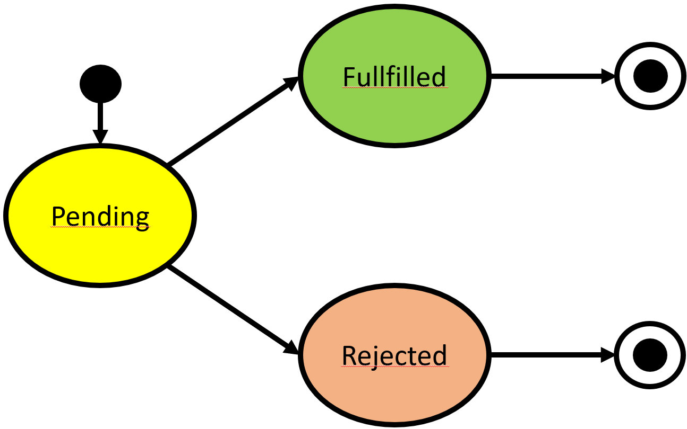

# Asynchronisme avec des Promesses

Les promesses offrent une abstraction utile pour modéliser le déroulé de l'exécution d'une instruction asynchrone. Les promesses sont utilisées pour décrire le type de retour d'une instruction asynchrone.

En reprenant l'exemple de l'exercice précédent (composition d'une image mosaïque à partir d'une requête), la fonction de recherche d'images correspondant à une description (searchImages) deviendrait alors searchImageP (P pour Promesse), ne prendrait plus en paramètre qu'une description, et renverrait une promesse de **`readonly string[]`** :

```typescript
/**
 * searchImagesP 
 * @param { string } description
 * @return { Promise<string[]> }
 */
function searchImagesP(description: string): Promise<readonly string[]>;
```

Plus généralement, une fonction **`f`** synchrone qui renvoie un résultat de type **`T`** aura pour équivalent asynchrone une fonction **`f'`** qui renvoie comme résultat le type **`Promise<T>`**.

Nous allons voir maintenant de quoi une promesse est constituée et comment elle peut être exploitée pour gérer l'asynchronisme.

## Cycle de vie d'une promesse

Une promesse est un ***objet*** dont le rôle est de modéliser l'état dans lequel se trouve le traitement de l'instruction asynchrone qui a produit cette même promesse. Lorsqu'elle est créée, la promesse se trouve dans l'état **`pending`** qui indique que l'instruction est en cours d'exécution. Lorsqu'elle sort de l'état **`pending`**, on dit que la promesse est **`résolue`**. La promesse peut être résolue de deux façons :

1. Si tout s'est bien passé, la promesse passe dans l'état **`fullfilled`** qui indique que le traitement est terminé, il est alors possible de récupérer la valeur du résultat.
2. Si au contraire une erreur est survenue lors du traitement, alors la promesse passe dans l'état **`rejected`** et il est alors possible de récupérer la raison pour laquelle l'erreur est survenue.

<figure style="text-align: center; width: min(100%, 350px); margin: auto;">
    
    
    <caption>Cycle de vie de l'instruction asynchrone modélisé par une promesse.</caption>
</figure>
