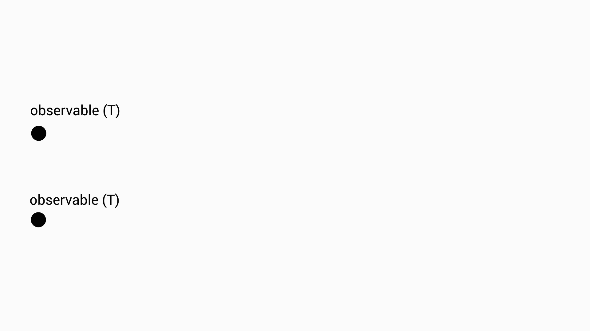

# La bibliothèque RxJs

Lorsqu'on programme des systèmes interactifs, il est essentiel de pouvoir définir ses propres observables, que ce soit au niveau de l'interface (clic sur bouton par exemple) ou au niveau des données qu'on manipule (ex : être prévenu quand une sonde mesure un changement de température).

Nous avons vu précédemment qu'il est possible d'utiliser pour cela les signaux, notemment avec des application Angular. Cependant les signaux ne gère pas les aspects temporels (on ne peut pas définir un signal qui émet une valeur toutes les secondes par exemple).

Nous utiliserons dans ce bloc la bibliothèque RxJS car elle permet non seulement de définir proprement des observables mais aussi de combiner et de dériver ces observablesà l'aide d'une véritable algèbre d'observables. Si les signaux peuvent répondre à la problématique d'orchestrer des observables atemporels, RxJS permet de gérer finament les aspects temporels.

Dans RxJS, un observable définit un flux d'événements qui a un début, peut avoir une fin, peut émettre des valeurs et se termine soit par un marqueur de fin soit par une erreur (c'est un OU exclusif). La figure suivante illustre la notation graphique qui est utilisée pour les représenter.

<figure style="text-align: center; margin: auto; max-width: min(100%, 773px);">
  
  
  <figcaption>
    Arbre des composants
  </figcaption>

</figure>

## Typage

Un observable RxJS est bien un observable au sens du patron de conception Observateur/Observable, il est possible de s'y abonner et de s'y désabonner. L'observable notifiera les observateurs lorsqu'une nouvelle valeur est produite, lorsqu'une erreur est produite et lorsque le flux est terminé. L'exemple suivant illustre comment s'abonner aux valeurs produites par un observable, ainsi qu'à l'éventuelle erreur qu'il pourrait renvoyer et au signal de terminaison.

L'abonnement se fait à l'aide de la méthode **`subscribe`** qui prend en paramètres, de façon optionnel, un **`Partial<Observer<T>>`** ou une simple fonction de type **`(value: T) => void`**. La fonction subscribe renvoie comme valeur de retour un objet de type **``Subscription``** qui permet ensuite de se désabonner.

```typescript
export interface Observable<T> {
  ...
  subscribe(observerOrNext?: Partial<Observer<T>> | ((value: T) => void)): Subscription;
}
```

Pour être complet, voici le type de **`Observer<T>`** :

```typescript
export interface Observer<T> {
  // next est appelé par l'observable pour notifier une nouvelle valeur
  next: (value: T) => void;
  
  // error est appelé par l'observable pour notifier une erreur
  // Cela termine l'observable sur cette erreur
  error: (err: any) => void;
  
  // complete est appelé par l'observable pour notifier la fin du flux
  // Cela termine l'observable sans erreur
  complete: () => void;
}
```

Quelques exemples d'utilisation :
  
```typescript
let obs: Observable<number> = ...;
// ... On peut s'abonner à l'observable
const sub1 = obs.subscribe( console.log );
const sub2 = obs.subscribe({
  next: val => console.log(`obs publie la valeur ${val}`),
  error: err => console.error(`obs termine sur une erreur' ${err}`),
  complete: ()  => console.log(`obs est terminé`)
})

// ... Plus tard on peut se désabonner
sub1.unsubscribe();
sub2.unsubscribe();
```
