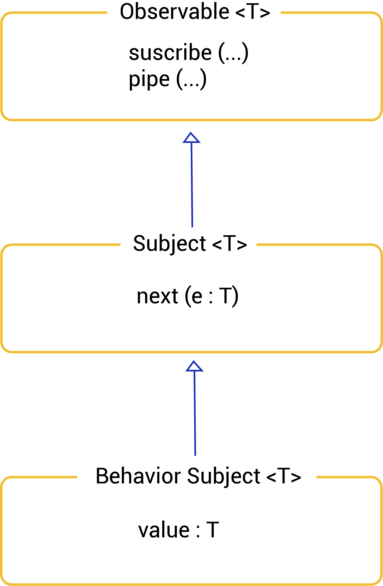

# Observable, Subject et BehaviorSubject

La bibliothèque RxJS offre de nombreux objets observables. Nous allons en étudier trois pour le moment : les **`Observables`**, les **`Subjects`** et les **`BehaviorSubject`**.

<figure style="text-align: center; margin: auto; max-width: min(100%, 235px);">
  
  
  <figcaption>
    Arbre des composants
  </figcaption>

</figure>

## Observables froids et observables chauds

Les **`Observable`** sont la classe de base. Nous avons vu qu'ils permettent de s'abonner (méthode subscribe). Il est possible de dériver un observable en un autre observable en appliquant des opérateurs (méthode pipe, que nous verrons bientôt). Il est possible de [créer soi-même un observable](https://rxjs-dev.firebaseapp.com/guide/observable) qui publiera des valeurs. Nous illustrons dans le StackBlitz suivant la définition d'un tel observable. Il faut noter que, dans un tel cas, un nouvel observable est instancié à chaque nouvel abonnement (on parle d'**`observable « froid »`**). Ainsi, pour un observable qui publierait les entiers de 0 à 10 par interval d'une seconde, un premier abonnement entraînerait la notification des nombres 0 à 10, un second abonnement qui serait fait 3 secondes après le premier sur ce même observable froid entraînerait la notification des nombres 0 à 10 (avec un décalage de 3 secondes par rapport au premier abonnement). Nous illustrons cela dans le StackBlitz ci-dessous.

<iframe src="https://stackblitz.com/edit/theme-ihm-observable-subject-behaviorsubject?embed=1&amp;file=index.ts&amp;hideExplorer=1&amp;view=preview" style="width: 100%; height: 640px;"></iframe>

En général, ça n'est pas ce qu'on veut faire et c'est la raison pour laquelle nous utiliserons plutôt des **`observables « chaud »`** (via des **`Subject`** ou des **`BehaviorSubject`**).

## Les subjects, des observables chauds

Les **`Subject`** sont une sous-classe d'**`Observable`**. Contrairement aux observables, les Subjects ne sont pas répliqués quand on s'abonne à eux. En cela, on les qualifie d'**`observables « chaud »`**, cela implique aussi qu'un Subject peut émettre une même valeur à plusieurs abonnés. Pour publier une valeur, on utilise la méthode **`next`** de l'objet Subject. Les observateurs sont prévenus lorsque le Subject publie une nouvelle valeur.

Il est enfin possible de n'exposer du Subject qu'un Observable, via la méthode **`asObservable`** qui renvoie un observable lié au Subject. Cet observable se comporte comme le sujet mais ne permet pas à celui qui en a la référence de publier de nouvelles valeurs (car un observable ne dispose pas de la méthode **`next`**). **Une bonne pratique est donc d'encapsuler un Subject et de n'exposer que l'observable**.

## Les BehaviorSubject, des observables chauds avec une valeur courante

Enfin, les **`BehaviorSubject`** sont une sous-classe de Subject qui ajoutent la notion de valeur courante (attribut **`value`**). Ainsi, tout nouvel observateur sera prévenu de la valeur courante dès qu'il s'abonne. La méthode **`next`** permet de changer la valeur courante et entraîne, comme pour les Subject, que tous les abonnés sont prévenus de ce changement. Nous utiliserons souvent des BehaviorSubject pour coder les états de nos systèmes interactifs.
